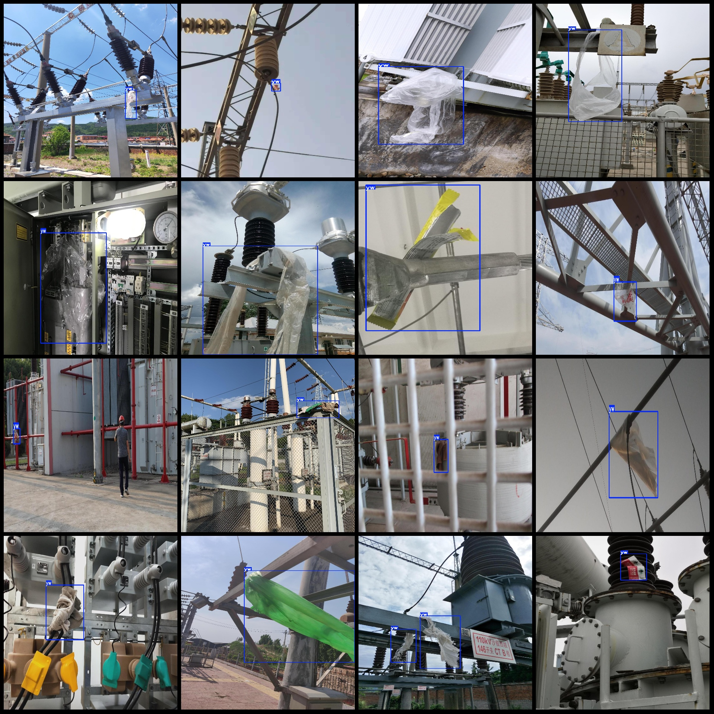

# Power Scene Transmission Line Intrusion Inspection and Object Detection Dataset (VOC+YOLO format, 4165 images in 1 category)

Dataset Format: Pascal VOC format + YOLO format (without split path in txt files, only containing jpg images along with corresponding VOC format xml files and YOLO format txt files)
Number of Images (Total number of jpg files): 4165
Number of Annotations (Total number of xml files): 4165
Number of Annotations (Total number of txt files): 4165
Number of Annotation Categories: 1
Repository: firc-dataset
Annotation Category Name (Note that the order of categories in the YOLO format is different from this, and should be aligned with the labels folder's classes.txt): ["yw"]
Number of Boxes per Category:  
yw Boxes = 4417  
Total Boxes: 4417  
Dataset has some enhanced images
Image resolutions: Multi-resolution images, e.g., 1270x1693, 1270x952, etc.
Annotation tool used: labelImg
Annotation rules: Draw boxes around the categories
Important Notice: No guarantees are made for the accuracy of the trained models or weight files
Preview of images:
Annotation examples:

## Images

Here is a pay link on Stripe ( https://buy.stripe.com/3cs8yP7sY87d0vu9AB ). Please contact me lonlonago@foxmail.com after funding $89, and I will send you a complete data files , thank you!

